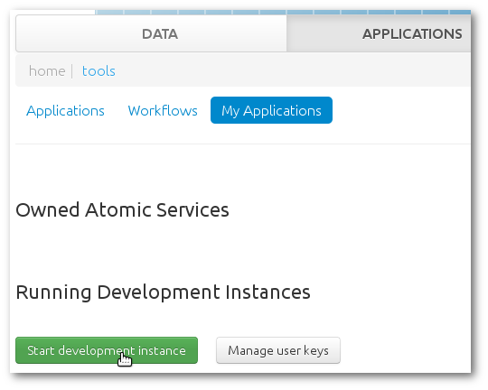
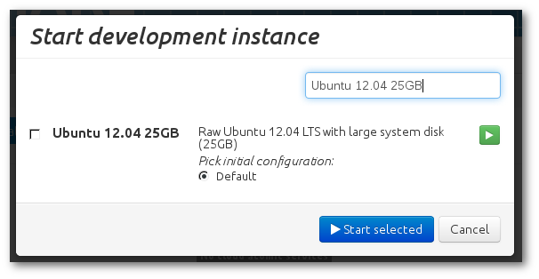
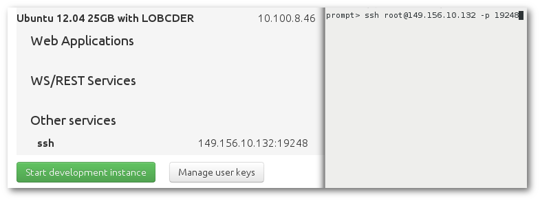
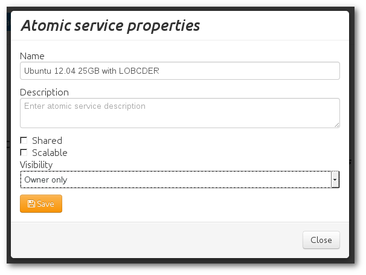
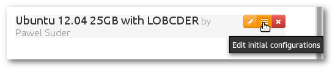
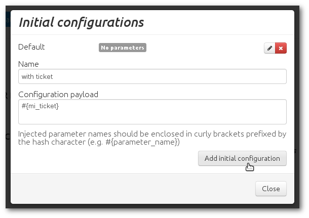

`lobcder` usage
=======================

Simple way
----------

- Boot up a fresh base appliance type from **Applications → My Applications**, eg. *Ubuntu 12.04*.

- Login on machine, download and install package `lobcder`.

- Logout and save running virtual machine as a new atomic service.

- Add initial configuration.
    - create new inital configuration which contains only `#{mi_ticket}`
    - `#{mi_ticket}` contains token used to mount LOBCDER resources

- Boot up your atomic service with the proper initial configuration.
- Login on new machine and check if it is mounted by command `mount`.

Content
-------

`lobcder` contains:

- `/etc/lobcder` with scripts and config files
    - `lobcder.conf` defines variables used in scripts
    - `get_ticket.sh` contains function used to download ticket with token from user data
    - `parse_ticket.sh` contains function used to parse ticket to get toketn from user data
    - `short_token.sh` contains function to short token

Variables
---------

Variables are defined in `/etc/lobcder/lobcder.conf` file.

- `LOBCDER_USER_DATA_URL` - URL used to download data from used data
    - default value: `http://169.254.169.254/openstack/latest/user_data`
- `LOBCDER_SHORT_TOKEN_URL` - URL used to short token
    - default value: `https://lobcder.vph.cyfronet.pl/lobcder/urest/getshort`
- `LOBCDER_MOUNT_URL` - URL of remote lobcder resource
    - default value: `https://lobcder.vph.cyfronet.pl/lobcder/dav`
- `LOBCDER_DIR` - path to place of mouting lobcder resource
    - default value: `/media/lobcder`
- `LOBCDER_UID` - name or id of UID used to mount
    - default value: `root`
- `LOBCDER_GID` - name or id of GID used to mount
    - default value: `root`

Functions
---------

- `get_ticket`
    - defined in `/etc/lobcder/get_ticket.sh`
    - default behavior:
        - download ticket from user data
- `parse_ticket`
    - defined in `/etc/lobcder/parse_ticket.sh`
    - default behavior:
        - pass ticket as token without parsing
- `short_token`
    - defined in `/etc/lobcder/short_token.sh`
    - default behavior:
        - short token using external tool

Service
-------

lobcder-automount is registered as a service. Depends on Linux distribution the initial script and basic operation are different.

- Ubuntu, Debian, `*.deb` based Linux
    - `/etc/init.d/lobcder` - initial script
    - `service lobcder (start|stop)` - start/stop manually lobcder
    - `update-rc.d lobcder (defaults|remove)` - enable/disable lobcder init script default behavior
- CentOS, `*.rpm` based Linux
    - `/etc/init.d/lobcder` - initial script
    - `service lobcder (start|stop)` - to start/stop manually lobcder
    - `chkconfig (--add|--del) lobcder` - enable/disable lobcder init script default behavior
- Arch Linux, `*.pkg` based Linux
    - `/usr/sbin/lobcder` - initial script
    - `/usr/lib/systemd/system/lobcder.service` - describe default init script behavior
    - `systemctl (start|stop) lobcder` - start/stop manually lobcder
    - `systemctl (enable|disable) lobcder` - enable/disable lobcder init script default behavior
